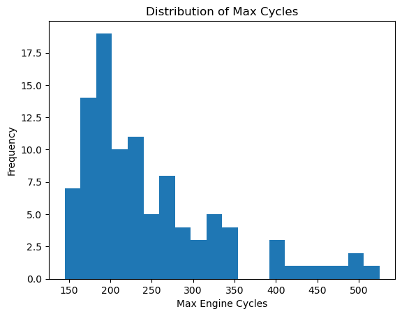

# Predictive Maintenance on a Jet Engine

Can We predict when a part will fail?

* I want to be able to predict how long till an engine will fail based on sensor readings.

You can find the the dataset I used for this project at [**this link**](https://phm-datasets.s3.amazonaws.com/NASA/6.+Turbofan+Engine+Degradation+Simulation+Data+Set.zip). Of the 4 potential datasets, I used the FD003 dataset. This data is collected from 100 different engines. These engines are run till failure is hit. Sensor readings are recorded once during each cycle. A cycle is defined as one instance of engine start to engine shutdown. This is more or less equivalent to number of trips the engine has been on.

The above graph shows the distribution of the life of the engines. This 

## Data Cleaning

The data did not need much cleaning. All columns were already numeric. I did have to remove some columns. I removed all columns that did not contain unique data within the column. I also removed any columns that had no effect on the model.
The columns were not defined within the CSVs. I used a dictionary in the variables file to define column names. I also created a column for Remaining Useful Life (RUL). This was done by subtracting the the current cycle by the maximum cycle amount for each engine.

## Model Creation and Testing

I chose to use a Random Forest Regressor. I tested 4 other models. I used R^2 and RMSE to evaluate the models. My intial testing was showing very bad scores across the board. The engines with very long lifespans skewed the data. To correct this, I used the clip method in pandas to limit the maximum RUL to 120. I want to focus on the data as it gets closer to 0 RUL. This transformation allowed me to start seeing accurate predictions from the model. None of the other models came close to matching the scores I was getting with the Random Forest Regerssor. I ran several itterations of Gridsearch CV, but none of the changes resulted in a significant improvement in R^2 or RMSE.
